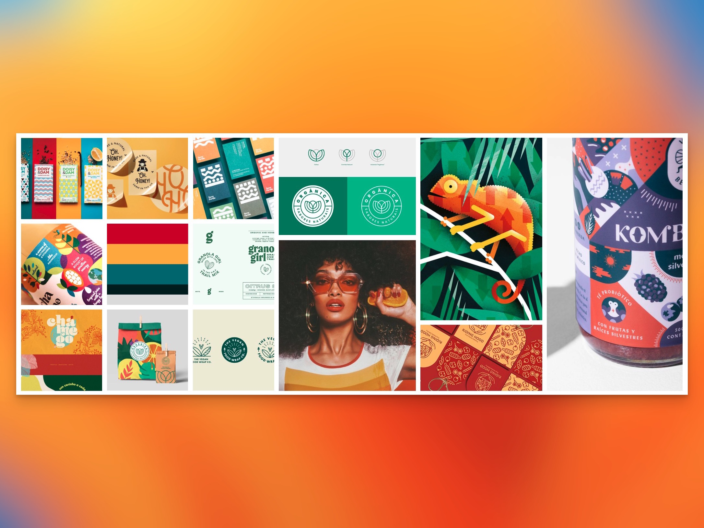
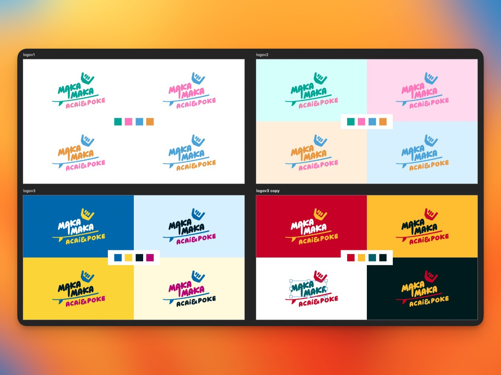
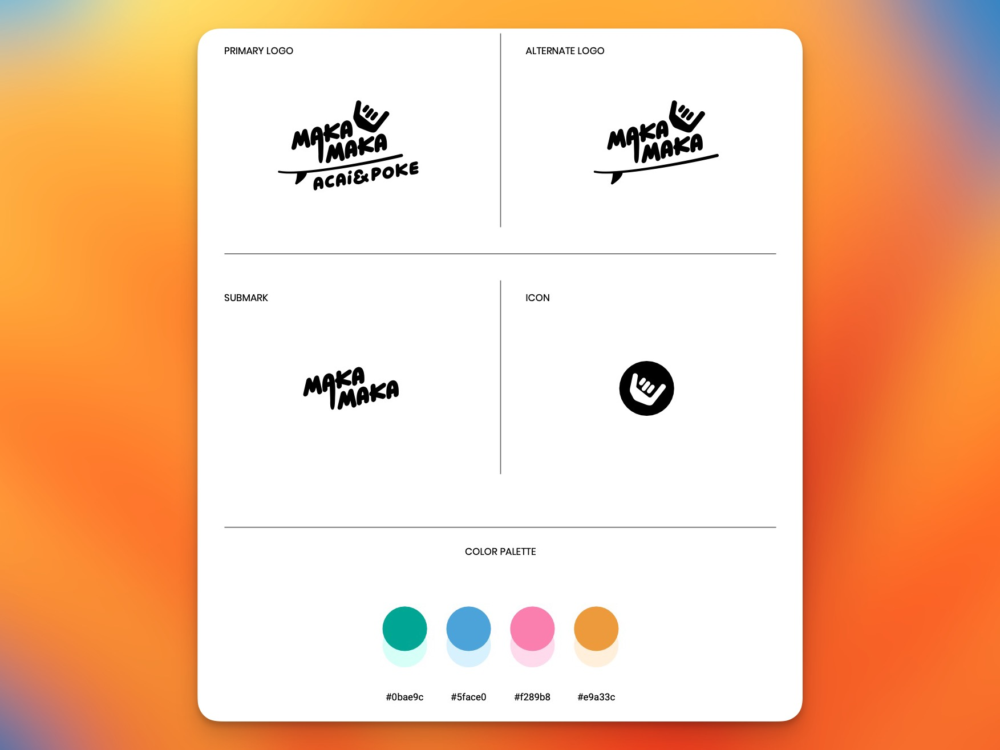
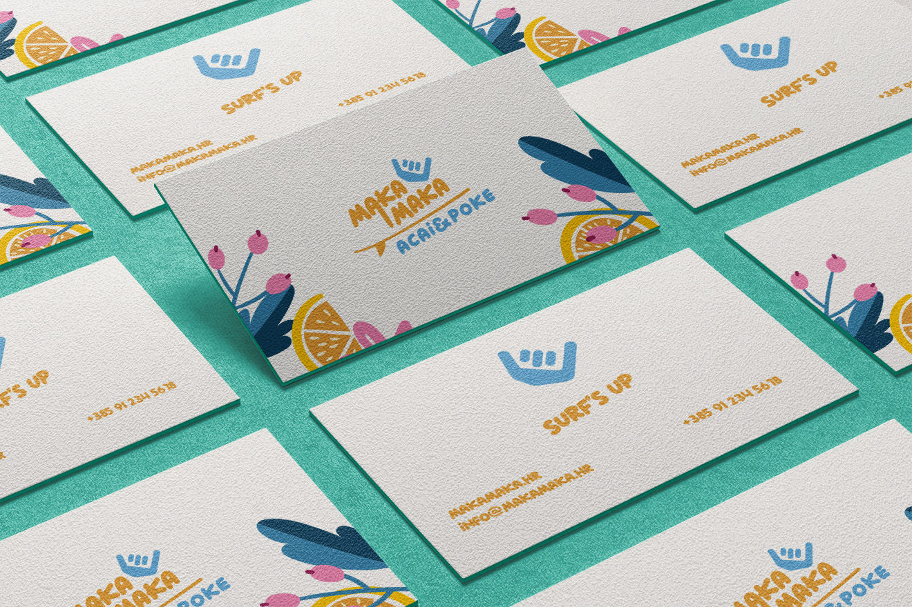
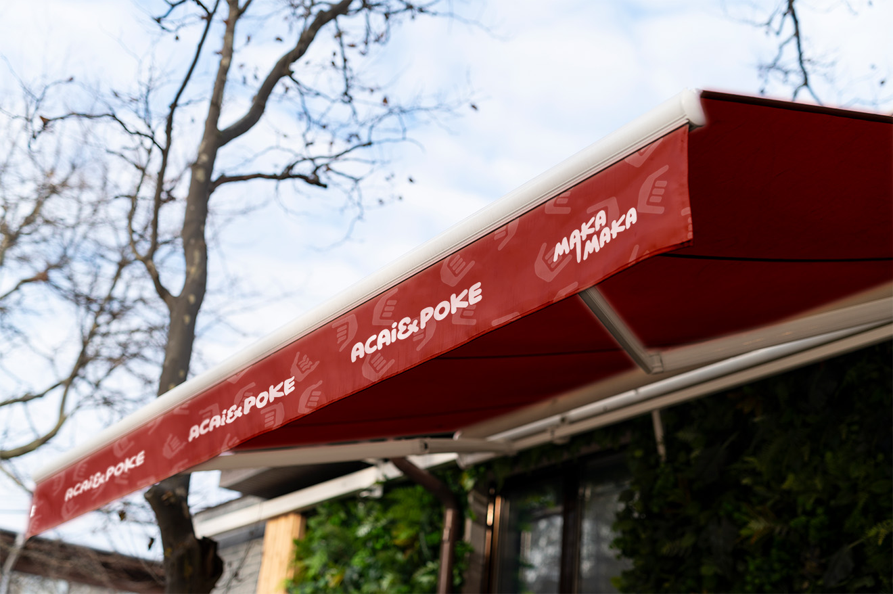
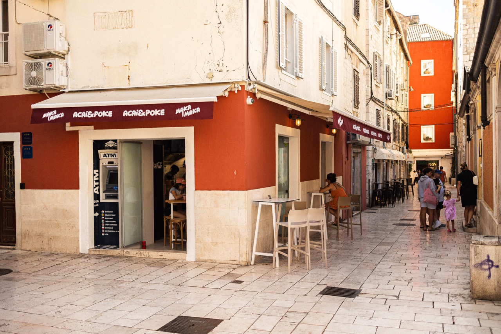
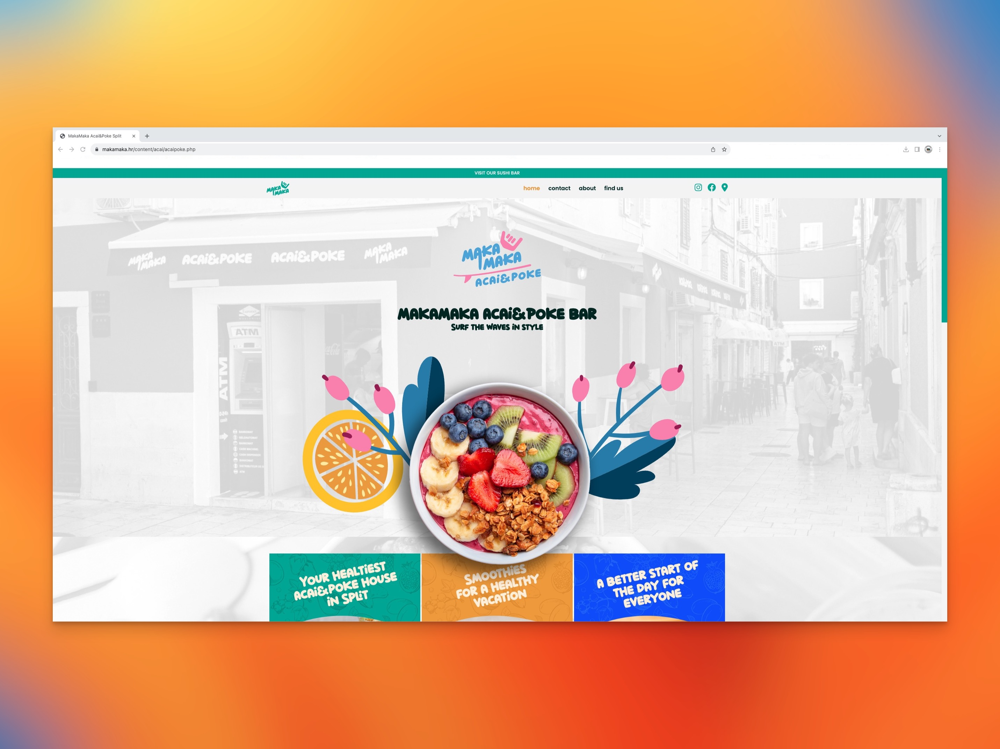
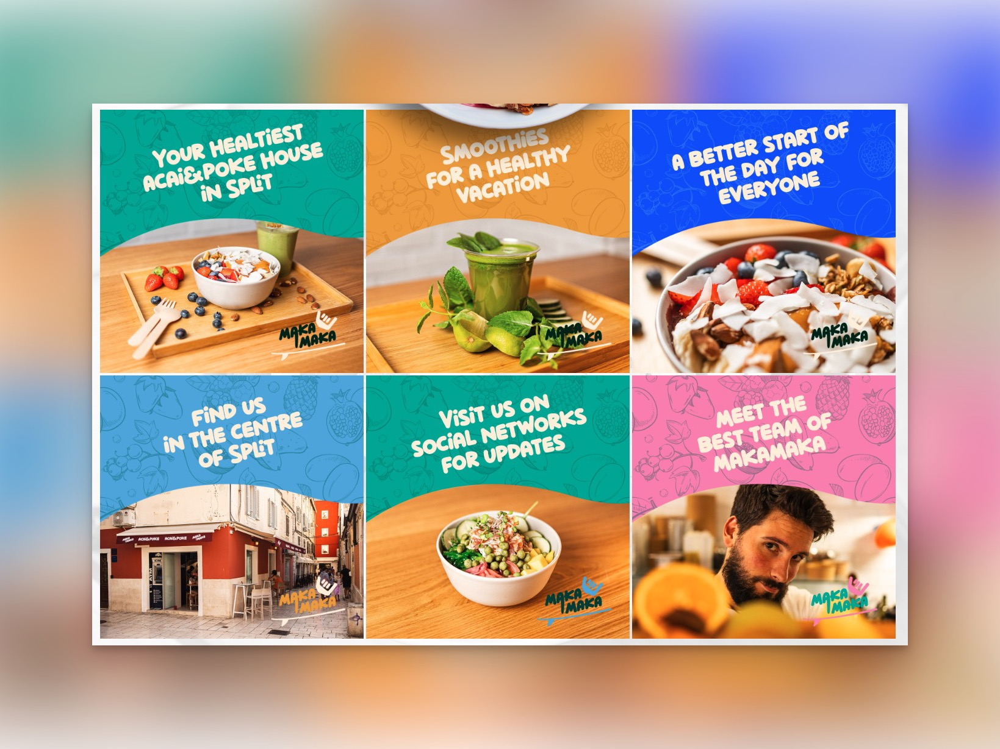

<h2 class="h5 padb-100">Naš rad</h2>

<h3 class="h3 thin padb-400">01. Dizajn</h3>

<h4 class="h5 padb-400">Vizualni identitet</h4>

Kao i svaki projekt kreiranja vizualnog identiteta i izgradnje novog branda i ovaj smo započeli detaljnim briefingom na kojem smo ustanovili ključne smjernice za ostvarivanje cilja. 

<ul class="body padb-100 indent" >
<li>&#8226 ciljana publika</li>
<li>&#8226 što publika želi traži?</li>
<li>&#8226 izrada "moodboarda"</li>
<li>&#8226 poruka branda</li>
</ul>

Pomoću ovih smjernica možemo lakše utvrditi smjer u kojem krenuti ali i sigurno reference na koje se uvijek možemo referirati tokom procesa dizajniranja kako bi bili sigurni da i vuzalni dizajn odgovara na postavljena pitanja.

1.1. MakaMaka Acai&Poke Bar moodboard

<h4 class="h5 padb-400">Logotip</h4>

Neobična fuzija koju nudi ovaj restoran bila je izazov sam po sebi te smo u ovom slučaju kreirali nekolicinu različlitih varijacija logotipa dok klijent nije bio u potpunosti zadovoljan sa dostavljenim radom. Ciljana publika je mlađa generacija željna zabave u opuštenoj i idiličnoj atmosferi Splita odnosno Mediterana u fuziji sa sočnim i zdravima tropskim okusima. Savršena fuzija za ljetne i bezbrižne dane.

1.2. MakaMaka Acai&Poke bar logotip ideje

1.3. MakaMaka Acai&Poke bar finalni logotip

<h4 class="h5 padb-400">Print</h4>

Nakon izrade osnovnih elemenata vizualnog identiteta odradili smo i grafičku pripremu materijala za tisak koji predstavljaju unificirani vizualni identitet pomoću kojeg će ovaj brand biti lakše prepoznatljiv svojoj vlastitoj publici. 

1.4. MakaMaka Acai&Poke Bar vizitke

1.5. MakaMaka Acai&Poke projekt tende

1.6. MakaMaka Acai&Poke Bar vanjska izvedba

<h3 class="h3 thin padb-400 padt-900">02. Web dizajn</h3>
<h4 class="h5 padb-400">Skiciranje i dizajn</h4>

U fazi dizajniranja web stranice veliku pozornost smo posvetili namirnicama restorana koji osim što imaju atraktivan vizualni dojam ujedno i na osobit način predstavljaju publici svoju paletu vrlo dostupnih zdravih i ukusnih proizvoda. 

2.1. MakaMaka Acai&Poke Bar web dizajn

2.2. MakaMaka Acai&Poke Bar web dizajn

<h4 class="h5 padb-400">Razvoj</h4>

U razvoju stranice vodili smo računa da bude izgrađena po svim modernim standardima te optimizirana za rangiranje na pretraživačima. Također je obavljena integracija sa Google Analytics te Google Console servisima.

