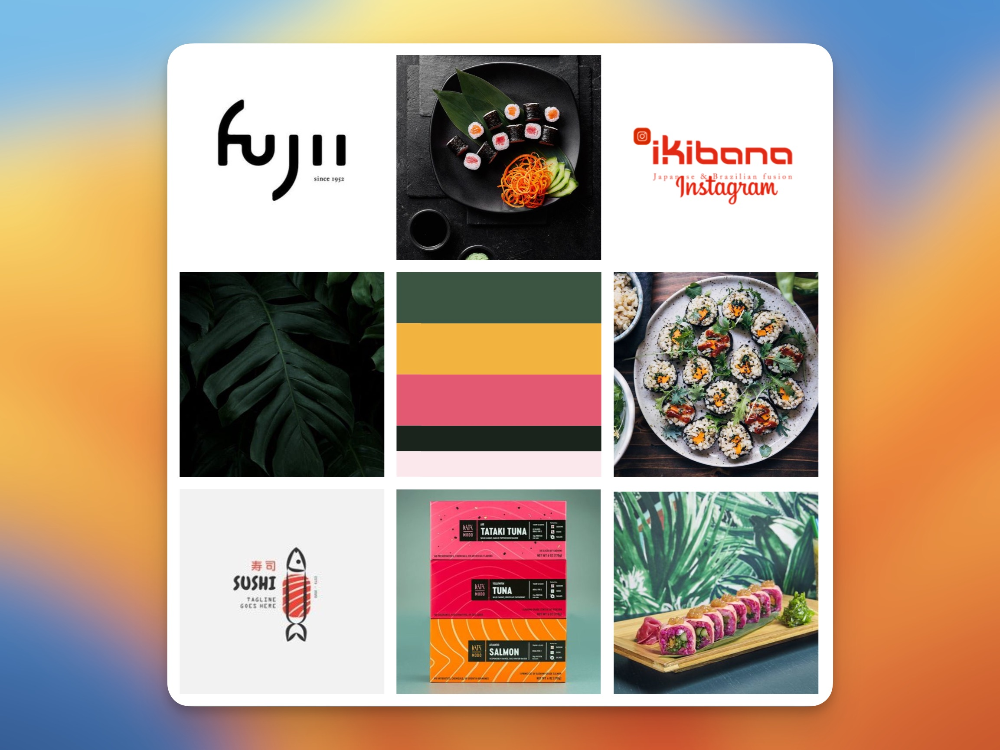
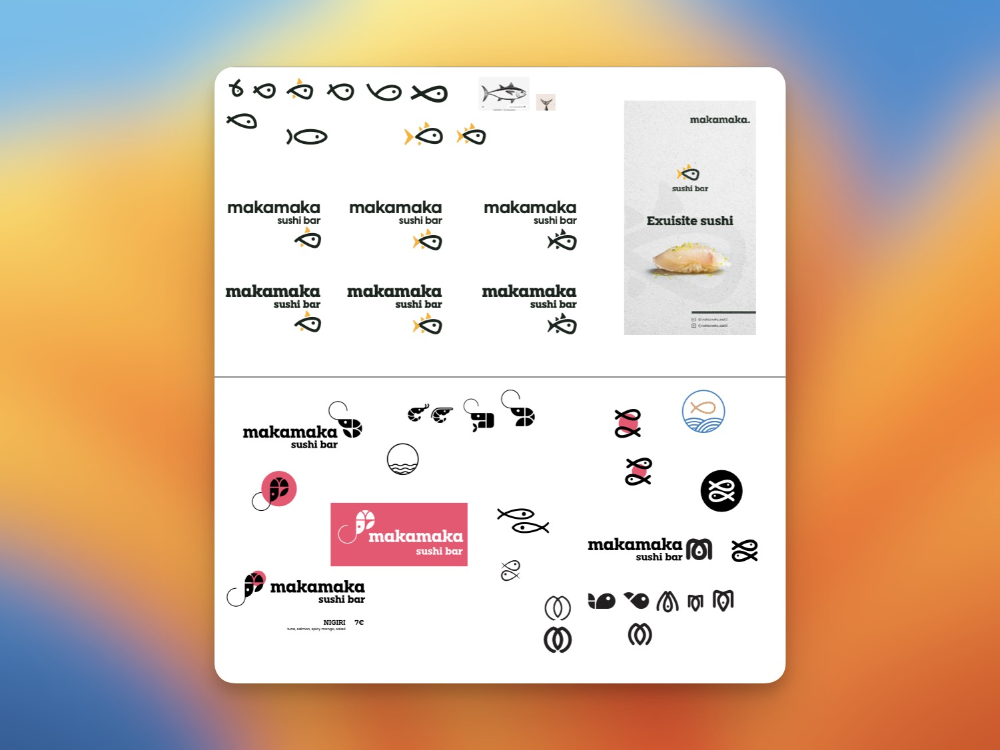
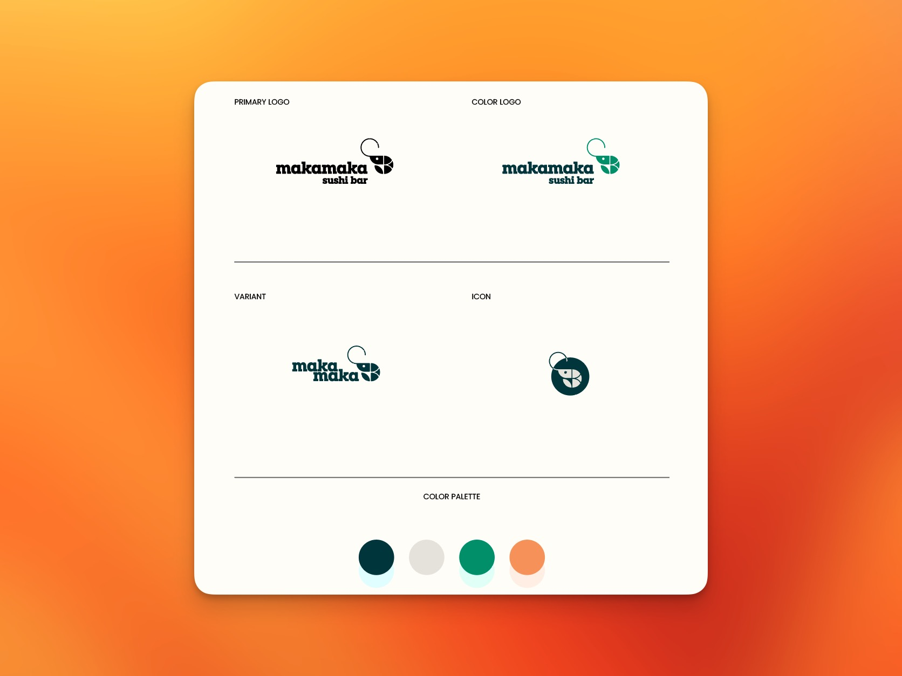
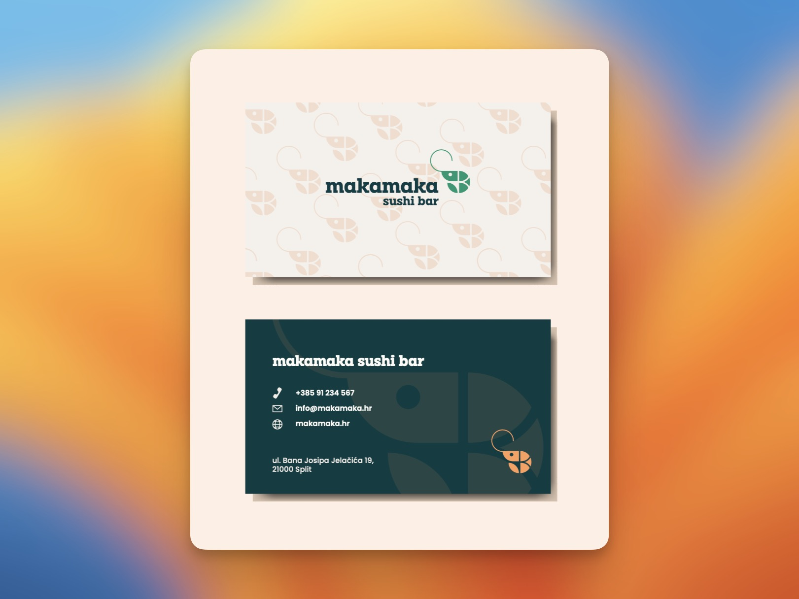
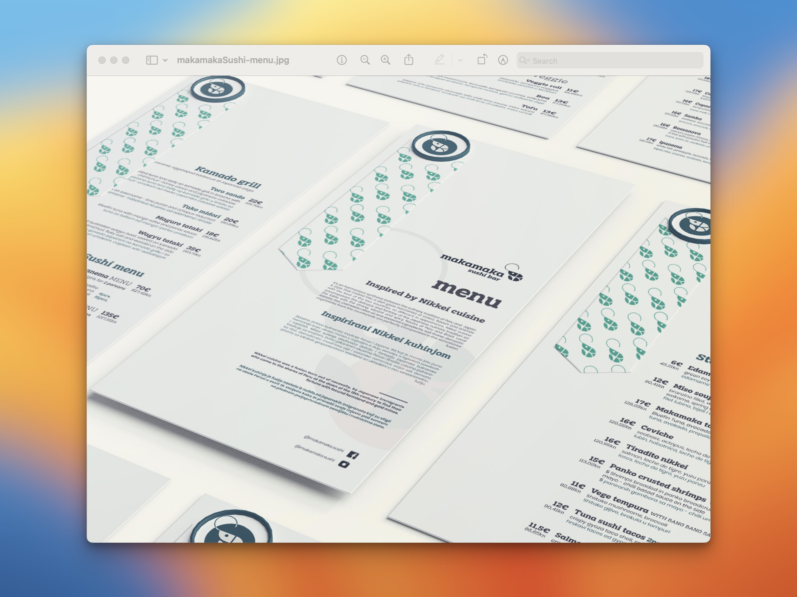
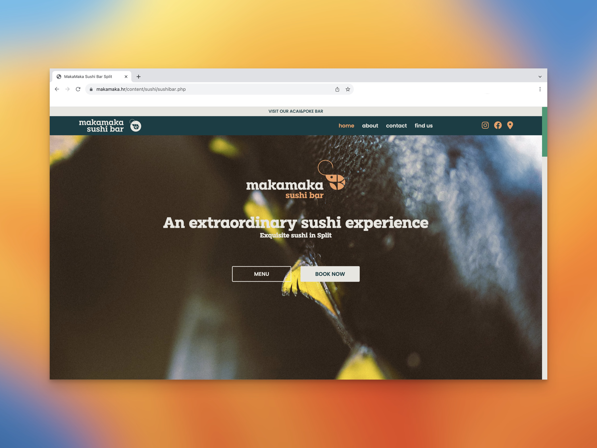
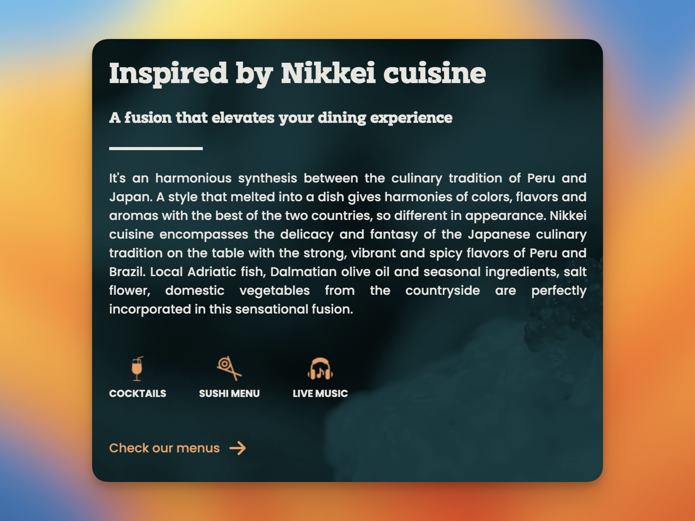

<h2 class="h5 padb-100">Naš rad</h2>

<h3 class="h3 thin padb-400">01. Dizajn</h3>

<h4 class="h5 padb-400">Vizualni identitet</h4>

Početak projekta započeli smo detaljnim sastankom na kojem smo utvrdili osnovne vrijednosti i ciljeve projekta kao što su:

<ul class="body padb-100 indent" >
<li>&#8226 ciljana publika</li>
<li>&#8226 problem i rješenje</li>
<li>&#8226 izrada "moodboarda"</li>
<li>&#8226 poruka koju šalje brand</li>
</ul>

Ove stavke su obično ono što prvo definiramo kada se radi o izgradnji branda i vizualnog identiteta jer nam pomažu da bolje shvatimo što zapravo želimo poručiti publici. A osim toga se uvijek možemo naknadno refirarti na njih kako bi bili sigurni da samo na pravom putu.

1.1. MakaMaka Sushi Bar moodboard

<h4 class="h5 padb-400">Logotip</h4>

Izrada logotipa je bila zahtjevna te smo nakon mnoštvo različitih varijacija došli do konačnog rezultata.

1.2. MakaMaka Sushi Bar logotip ideje

1.3. MakaMaka Sushi Bar finalni logotip

<h4 class="h5 padb-400">Print</h4>

Nakon izrade osnovnih elemenata vizualnog identiteta spremni smo za dizajn promotivnih materijala. Grafička priprema za vizitke i menu odražavaju unificirani vizualni identitet koji smo uspostavili te su materijali spremni za tisak. 

1.4. MakaMaka Sushi Bar vizitke

1.5. MakaMaka Sushi Bar menu

<h3 class="h3 thin padb-400 padt-900">02. Web dizajn</h3>
<h4 class="h5 padb-400">Skiciranje i dizajn</h4>

S obzirom da se radi o ugostiteljskoj ponudi, veliku pozornost kod dizajniranja web stranice posvetili smo vizualnim elementima. Shodno tome odradili smo fotografiranje jela i interijera samog restorana kako bi imali potrebne dizajn elemente. Osim toga smo i vodili računa o tome da stranica bude kvalitetno optimizirana i funkcionalna.

2.1. MakaMaka Sushi Bar web dizajn

2.2. MakaMaka Sushi Bar web dizajn

<h4 class="h5 padb-400">Razvoj</h4>

U razvoju stranice vodili smo računa da bude izgrađena po svim modernim standardima te optimizirana za rangiranje na pretraživačima. Također je obavljena integracija sa Google Analytics te Google Console servisima te booking sustav koji je implementiran preko treće strane.

