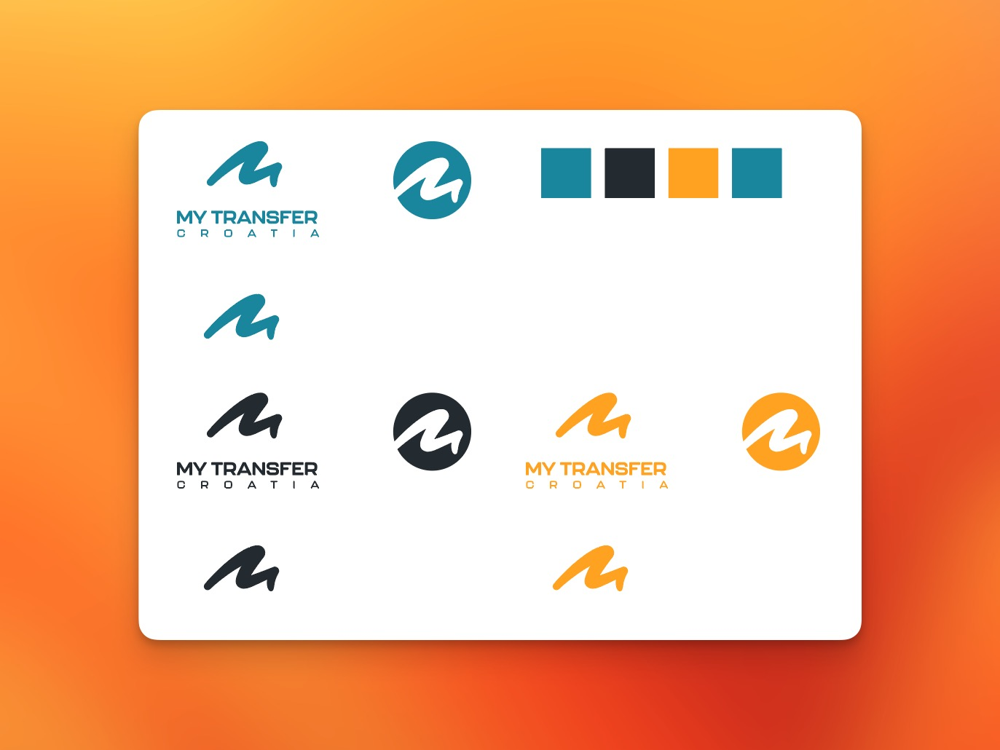
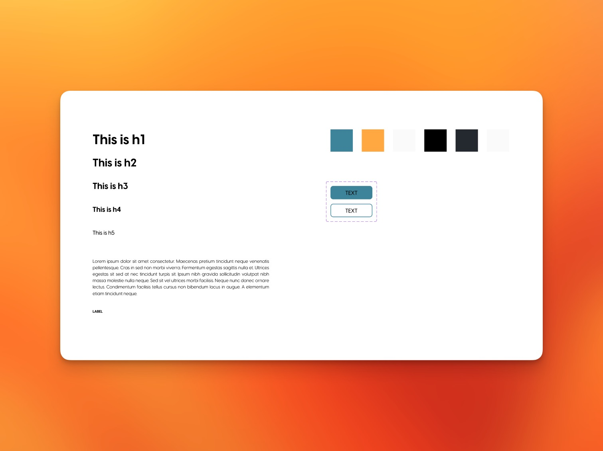
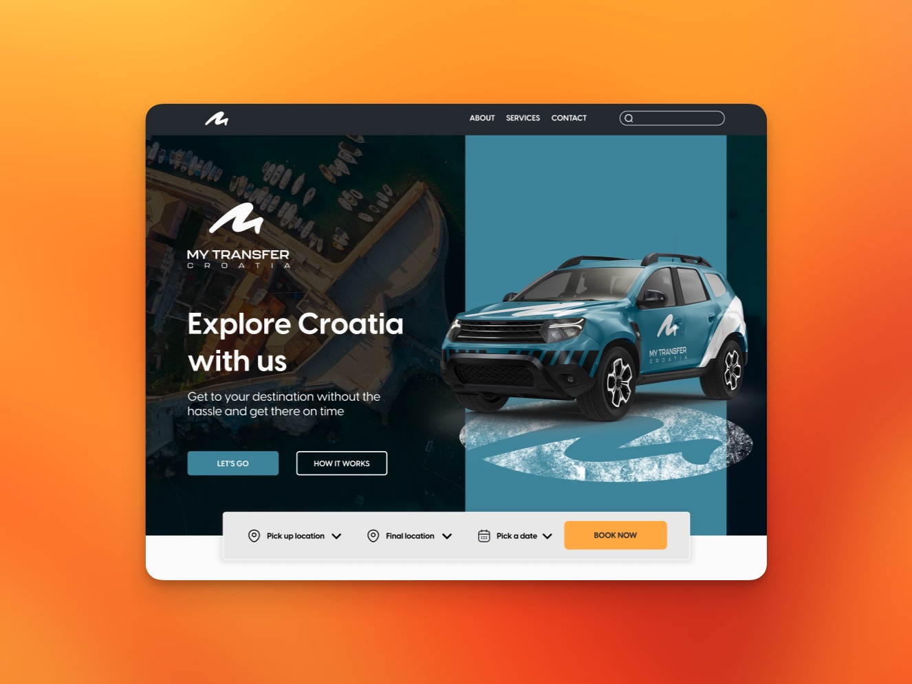
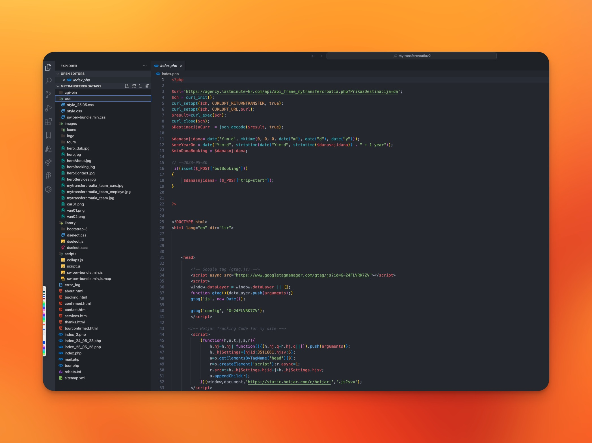

<h2 class="h5 padb-100">Naš rad</h2>

<h3 class="h1 thin padb-400">01. Vizualni identitet</h3>
<h4 class="h4 padb-400">Logotip i paleta boja</h4>

Klijent se odlučio za jednostavniji pristup izradi vizualnog identiteta te smo shodno tome kreirali zanimljiv i prepoznatiljiv logotip u nekoliko različitih varijacija kako bi odgovarao svim potrebama klijenta bilo da se radi o printu ili digitalnom mediju. Logotip je prilagođen svakovrsnoj upotrebi te smo i kreirali paletu boja kojom će se ovaj brand predstaviti te na taj način ostvariti bolju komunikaciju sa korisnikom.

1.1. My Transfer Croatia logo varijacije

<h3 class="h1 thin padb-400 padt-900">02. Web platforma</h3>
<h4 class="h4 padb-400">Skiciranje i dizajn</h4>

Prije implentacije i razvoja web stranice veliku pozornost posvetili smo dizajniranju i planiranju samog sadržaja. Cilj nam je bio pružiti korisniku jednostavnost korištenja ali i ugodno virtualno iskustvo. U tu svrhu odradili smo i foto snimanje osoblja i prijevoznih sredstava kako bi korisnici dobili bolju sliku o tome tko stoji iza usluge koju nudi klijent ali i kako bi ostvarili bolju povezanost sa brandom. Nakon završenog dizajna slijedio je razvoj.

2.1. My Transfer Croatia web dizajn prototip

2.2. My Transfer Croatia web dizajn skica

<h4 class="h4 padb-400">Razvoj i implementacija</h4>

Nakon dizajna u procesu razvoja web stranice otklonili smo te redizajnirali sve komponente s kojima smo naišli na izazove sa funkcionalnošću platforme. Naime u procesu razvoja često je slučaj da između estetike i funkcionalnosti dolazi do razilaženja te se mora odabrati optimalano rješenje koje će dovesti do boljih rezultata. Također smo vodili brigu o tome da stranica bude izgrađena po svim modernim standardima te optimizirana za rangiranje na pretraživačima. Također je obavljena integracija sa Google Analytics te Google Console servisima te booking sustav koji je implementiran preko treće strane.

2.3. My Transfer Croatia web razvoj

