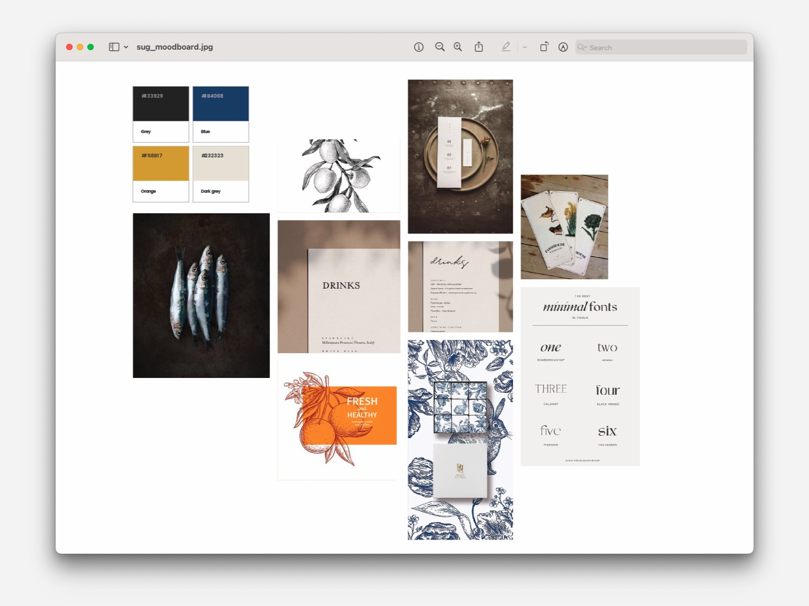
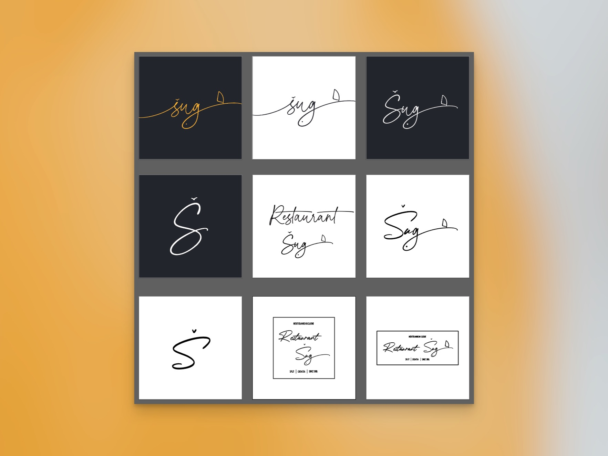
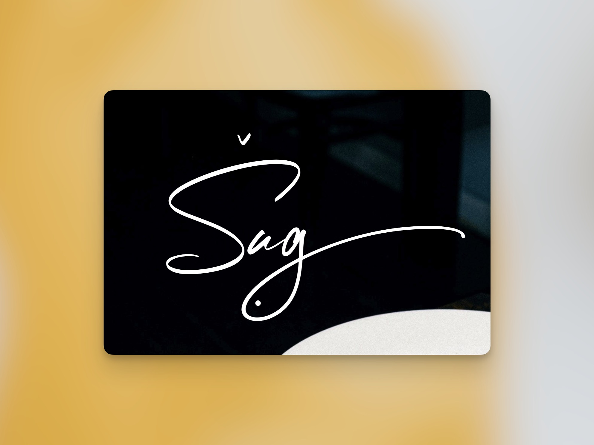
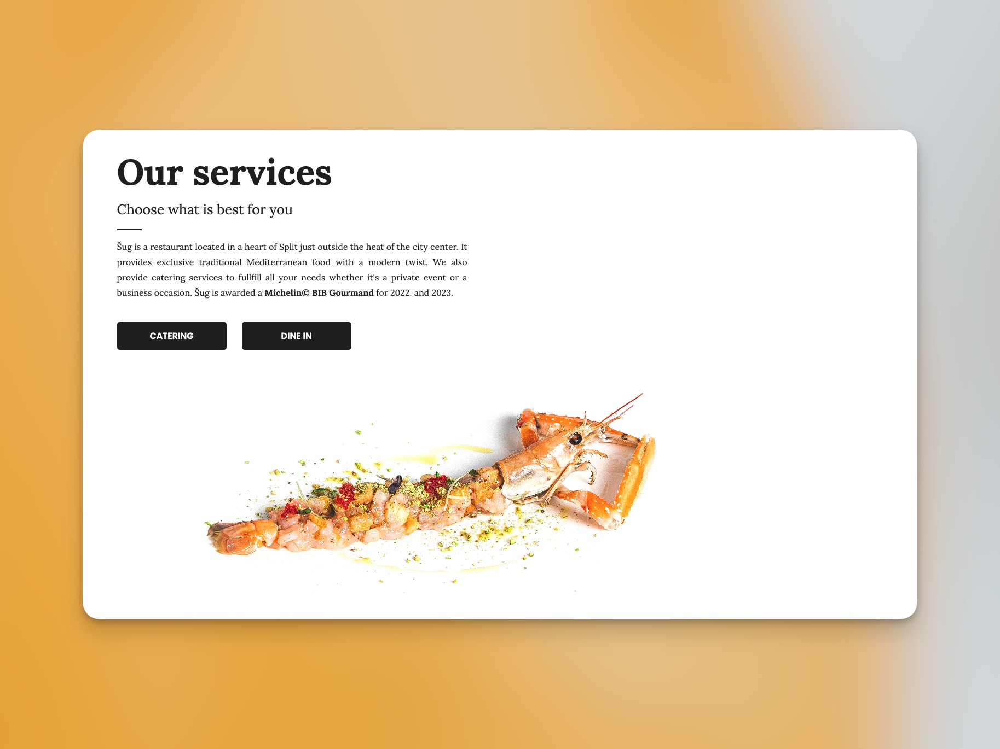
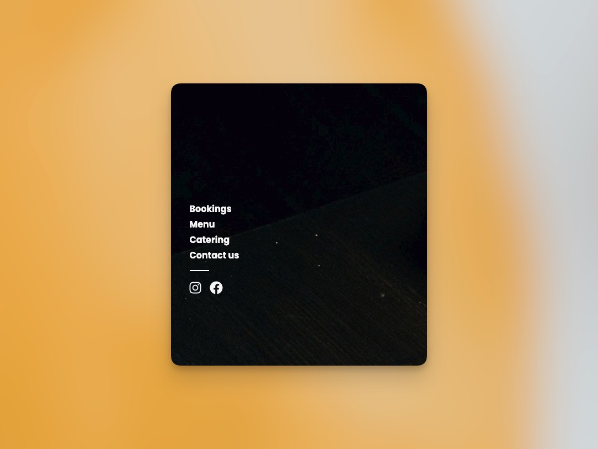
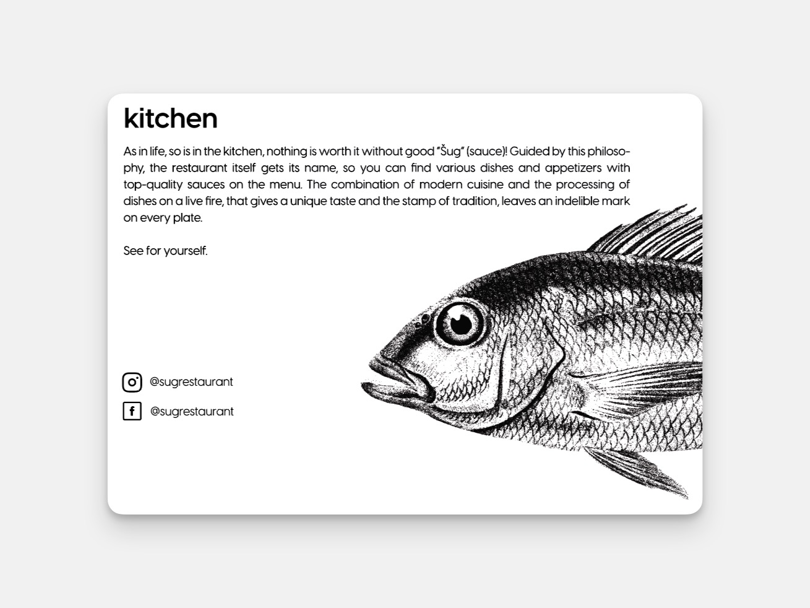

<h2 class="h5 padb-100">Naš rad</h2>

<h3 class="h3 thin padb-400">01. Dizajn</h3>

<h4 class="h5 padb-400">Identitet</h4>

U početnoj fazi najvažniji je korak bio sam brifing sa klijentom kako bi zapravo mogli ustanoviti primarne čimbenike za kreiranje vizualnog identiteta kao što su: 

<ul class="body padb-100 indent" >
<li>&#8226 ciljana publika</li>
<li>&#8226 problem i rješenje</li>
<li>&#8226 izrada "moodboarda"</li>
<li>&#8226 poruka koju šalje brand</li>
</ul>

Na ovaj način se tokom cijelog procesa izrade identiteta možemo referirati na početne ideje oko kojih smo se složili kako bi bili sigurni da su svi postavljeni uvjeti bili ispunjeni a klijent zadovoljan sa radom. 

1.1. Varijacije i ideje

Nakon izrade svih potrebnih elemenata te konačne potvrde od strane klijenta pristupili smo sljedećoj fazi dizajna i to kreiranju vlastitog identiteta restorana. U ovom segmentu razvijali smo koncept koji se zasnivao na izradi ključnih elemenata:

<ul class="body indent" >
<li>&#8226 logotip</li>
<li>&#8226 paleta boja</li>
<li>&#8226 tipografija</li>
<li>&#8226 ilustracijski elementi</li>
</ul>

1.2. Izrada logotipa

1.3. Izrada logotipa

<h4 class="h5 padb-400">Web</h4>

Kod izrade web stranice fokusirali smo se na tri ključna faktora:

<ul class="body padb-100 indent" >
<li>&#8226 brzina i funckionalnost</li>
<li>&#8226 vizualni dojam</li>
<li>&#8226 SEO optimizacija</li>
</ul>

S obzirom da se radi o web stranici koja ne zahtijeva izradu velike količine sadržaja odlučili smo se istaknuti ono što je ključan faktor samog projekta a to je vrlo jednostavno - proizvod. Vrhunska namirnica ali i kretivna izvedba same hrane na tanjuru. Tako smo došli do vrlo kretivnog rješenja kojim smo jelo iz kuhinje doveli na digitalni ekran te ga prezentirali kao da je serviran upravo Vama.  

Također smo veliku pažnju posvetili svim potrebnim elementima SEO standarda kako bi stranica bila usjpešno rangirana na Google indexu te samom webu. Klijentu je nakon završne faze dostavljen gotovi proizvod koji odgovara najsuvremenijim zahtjevima te je izvršena integracija sa Google Analytics te Google Console servisima, booking sustavom, te izradom Google Ads profila za potrebe digitalnog marketinga.

1.4. Web dizajn

1.5. Web dizajn

<h4 class="h5 padb-400">Print</h4>

U zadnjoj fazi dizajniranja u potpunosti smo spremni odgovoriti na sve zahtjeve koje nam je uputio klijent kao izradu pripreme za vizitke, menue te sve vrste promo materijala koje će se koristiti u svrhu promocije samog branda. 

1.6. Print menua

<h3 class="h3 thin padb-400">02. Produkcija</h3>
<h4 class="h5 padb-400">Video</h4>

Kao odgovor na sve brže rastuću konzumaciju materijala na društvenim mrežama i tu smo ponudili klijentu kvalitetno rješenje u vidu kreiranja video kampanja za potrebe na digitalnim platformama. U tu svrhu imali smo priliku sudjelovati u mnogo zanimljivih projekata sa klijentom pokazujući publici i onu stranu poslovanja koja nije tako očita na prvi pogled. Na taj smo način stvorili užu povezanost sa korisnicima te sa samim brandom.

<iframe width="560" height="315" src="https://www.youtube.com/embed/-FDY2TFLn2g?si=E4oVvgdFDyHPK6A3" title="Restoran Šug" frameborder="0"  allowfullscreen></iframe>

<h4 class="h5 padb-400">Fotografija</h4>

Također smo sa klijentom ostvarili i suradnju u vidu izrade kvalitetnih i profesionalnih fotografija za sve potrebe restorana.

<h3 class="h3 thin padb-400 padt-900">03. Marketing</h3>
<h4 class="h5 padb-400">Društvene mreže</h4>

U zadnjoj fazi projekta te nakon izrade mnoštva vizuala s kojim smo sada potpuno spremni odgovoriti zahtjevu digitalnog svijeta pripremili smo klijentu ponudu za održavanje društvenih mreža kako bi ostao aktivan te ažuran u prenošenju informaciju sada već znatnoj publici koja redovito prati sve događaje i objave.

<h4 class="h5 padb-400">Google Ads</h4>

Osim društvenih mreža pokrenuli smo i posebno kreirane i postavljanje marketinške kampanje koje su integrirane kroz gore navede servise. Ovime smo omogučili klijentu da izravno prati kako i koliko novca troši s obzirom na dobivene rezultate. U ovoj fazi od iznimne je važnosti pravilna i kvalitetno konstruirana web stranica kako bi se sa točnom sigurnošću moglo pratiti sve vrste analitičkih podataka.

